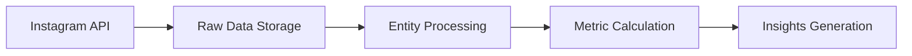
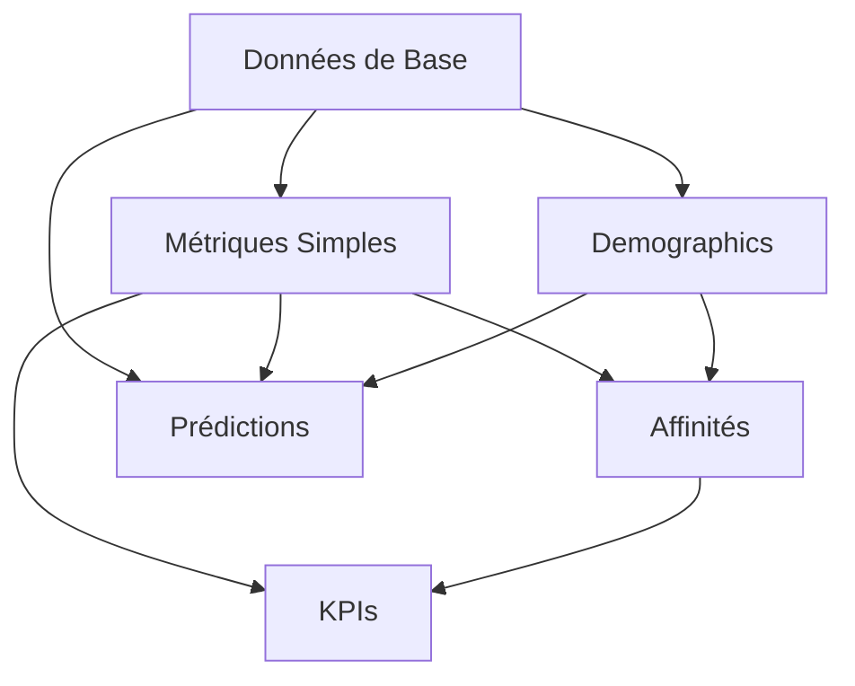

# Golddy - Plateforme d'Analytics pour Influenceurs

## 🎯 Concept

Golddy est une plateforme d'analytics avancée qui transforme les données brutes Instagram en insights actionnables pour les influenceurs. Le concept clé est la relation entre les données :

```
Instagram Data → Entités Relationnelles → Métriques Calculées → Insights
```

## 🏗 Architecture

### 1. Entités Fondamentales

Chaque entité représente une métrique calculée à partir de multiples sources de données Instagram :

```
📊 Données Instagram    →    🔄 Nos Entités    →    📈 Insights
- Posts                      - Posts                - Engagement Rate
- Stories                    - Followers            - Growth Prediction
- Followers                  - Demographics         - Brand Affinity
- Insights                   - Activities           - Audience Quality
```

### 2. Relations Clés

Les entités sont interconnectées pour créer des métriques complexes :

```typescript
Post ←→ Hashtags ←→ Brands   // Calcul d'affinité
User ←→ Followers ←→ Demographics   // Analyse d'audience
Post ←→ Engagement ←→ KPIs   // Performance financière
```

### 3. Flux de Données



## 🔄 Entités et Leurs Relations

### ActivityHours
- Source : Timing des interactions
- Relations : Posts, Followers
- Utilité : Optimisation des horaires de publication

### AffinityScores
- Source : Hashtags, mentions, engagement
- Relations : Brands, Posts, Engagement
- Utilité : Match influenceur-marque

### AudienceQuality
- Source : Engagement, croissance, authenticité
- Relations : Followers, Posts, Demographics
- Utilité : Évaluation de la qualité d'audience

### Demographics
- Source : Insights d'audience Instagram
- Relations : Followers, Locations
- Utilité : Compréhension de l'audience

### Followers
- Source : Historique des followers
- Relations : User, Demographics
- Utilité : Analyse de croissance

### GrowthPredictions
- Source : Historique, engagement, tendances
- Relations : Followers, Posts, Activities
- Utilité : Prévisions de croissance

### KPIFinanciers
- Source : Engagement, audience, croissance
- Relations : Posts, Followers, Brands
- Utilité : Valorisation monétaire

## 🔧 Utilisation

1. **Fetch des Données**
```typescript
// Exemple de flux de données
InstagramAPI → RawData → Entities → Metrics
```

2. **Calcul des Métriques**
```typescript
// Exemple de calcul d'engagement
engagementRate = (likes + comments) / followers * 100
```

3. **Génération d'Insights**
```typescript
// Exemple de prédiction de croissance
growthRate = analyzeGrowthPattern(followersHistory)
```

## 🚀 Points Forts

1. **Relations Intelligentes**
   - Chaque métrique utilise multiple sources
   - Calculs basés sur des relations complexes

2. **Données Enrichies**
   - Transformation des données brutes
   - Insights actionnables

3. **Scalabilité**
   - Architecture modulaire
   - Facilement extensible

## 📈 Exemples de Calculs

```typescript
// Calcul d'affinité marque
affinityScore = (
  hashtagMatch * 0.25 +
  brandMentions * 0.20 +
  engagement * 0.30 +
  sentiment * 0.15 +
  storyMentions * 0.10
)

// Qualité d'audience
audienceQuality = (
  engagement * 0.35 +
  authenticity * 0.25 +
  growth * 0.20 +
  consistency * 0.20
)
```

## 🔜 Évolution

Le système est conçu pour évoluer avec :
- Nouveaux réseaux sociaux
- Nouvelles métriques
- Nouveaux types d'insights

## 🛠 Stack Technique

- NestJS
- TypeORM
- PostgreSQL
- Instagram Graph API

## 📋 Plan d'Implémentation

### Phase 1 : Fondations & Données Brutes
1. **Configuration Instagram API**
   - Setup des credentials
   - Configuration des webhooks
   - Tests de connexion

2. **Entités de Base**
   - `User` : Profil utilisateur
   - `Posts` : Posts Instagram
   - `Followers` : Historique des followers
   - `Hashtags` : Tags utilisés

3. **Fetch Service**
   - Récupération des posts
   - Récupération des followers
   - Stockage des données brutes

### Phase 2 : Métriques Simples
1. **Engagement Basique**
   - Likes par post
   - Commentaires par post
   - Taux d'engagement global

2. **Croissance Simple**
   - Évolution des followers
   - Taux de croissance
   - Historique des variations

3. **Demographics**
   - Répartition géographique
   - Tranches d'âge
   - Distribution par genre

### Phase 3 : Relations & Calculs
1. **Relations Entre Entités**
   - Posts ↔ Hashtags
   - User ↔ Followers
   - Posts ↔ Locations

2. **Métriques Composées**
   - `ActivityHours` : Heures optimales
   - `AudienceQuality` : Qualité des followers
   - `Benchmarks` : Comparaisons basiques

### Phase 4 : Insights Avancés
1. **Prédictions**
   - `GrowthPredictions` : Prévisions de croissance
   - Analyse des tendances
   - Modèles prédictifs

2. **Affinités**
   - `AffinityScores` : Match avec les marques
   - Analyse des hashtags
   - Catégorisation du contenu

3. **KPIs Financiers**
   - Valorisation du compte
   - Potentiel de revenus
   - ROI par type de contenu

### Phase 5 : Intelligence & Optimisation
1. **Recommandations**
   - Suggestions de contenu
   - Optimisation des posts
   - Stratégies de croissance

2. **Automatisation**
   - Alertes intelligentes
   - Rapports automatiques
   - Optimisation continue

3. **Machine Learning**
   - Prédictions avancées
   - Segmentation d'audience
   - Détection de tendances

### Points de Contrôle
- ✓ Phase 1 : API fonctionnelle, données brutes stockées
- ✓ Phase 2 : Métriques de base calculées et affichées
- ✓ Phase 3 : Relations établies et fonctionnelles
- ✓ Phase 4 : Insights générés et pertinents
- ✓ Phase 5 : Système intelligent et autonome

## 📡 Ordre des Appels API et Formules

### 1. Données de Base (Requises pour tout)
```typescript
// 1.1 Profil utilisateur
GET /me
→ followers_count, following_count, media_count
→ Alimente : FollowersHistory, base pour tous les calculs

// 1.2 Posts récents
GET /me/media
→ liste des posts, likes, commentaires
→ Alimente : Posts, base pour engagement
```

### 2. Métriques Simples
```typescript
// 2.1 Insights des posts
GET /media/{id}/insights
→ reach, impressions, saves
→ Formule : engagementRate = (likes + comments) / followers * 100

// 2.2 Stories actives
GET /me/stories
→ stories actives et leurs métriques
→ Formule : storyEngagement = (vues + réponses) / followers * 100
```

### 3. Données Démographiques
```typescript
// 3.1 Insights d'audience
GET /me/insights
→ age_range, gender, city, country
→ Alimente : Demographics

// 3.2 Top locations
GET /me/locations
→ locations les plus taguées
→ Alimente : Locations, aide pour AffinityScore
```

### 4. Données pour Affinités
```typescript
// 4.1 Hashtags utilisés
GET /me/tags
→ hashtags populaires
→ Formule : hashtagScore = usageCount * avgEngagement

// 4.2 Mentions et collaborations
GET /me/mentioned_media
→ mentions par d'autres comptes
→ Formule : brandScore = mentionCount * audienceMatch
```

### 5. Données Temporelles
```typescript
// 5.1 Historique des posts
GET /me/media?period=year
→ historique complet
→ Formule : postFrequency = posts / timeRange

// 5.2 Insights historiques
GET /me/insights?period=lifetime
→ croissance historique
→ Formule : growthRate = (newFollowers - lostFollowers) / totalFollowers
```

### Formules Complexes (Nécessitent toutes les données ci-dessus)

1. **Qualité d'Audience**
```typescript
audienceQuality = (
  engagementRate * 0.4 +
  followerGrowth * 0.3 +
  demographicMatch * 0.3
)
```

2. **Score d'Affinité Marque**
```typescript
affinityScore = (
  hashtagMatch * 0.25 +
  audienceMatch * 0.25 +
  engagementQuality * 0.25 +
  brandMentions * 0.25
)
```

3. **Prédiction de Croissance**
```typescript
growthPrediction = (
  historicalGrowth * 0.3 +
  engagementTrend * 0.3 +
  contentQuality * 0.2 +
  seasonalFactor * 0.2
)
```

4. **KPI Financier**
```typescript
kpiFinancier = (
  followersValue * 0.3 +
  engagementValue * 0.3 +
  audienceQuality * 0.2 +
  brandAffinity * 0.2
) * marketFactor
```

### Dépendances des Formules



## 🤖 Agents ML et Entraînement

### Agents Principaux
1. **Agent Engagement**
   - Prédit les taux d'engagement
   - Analyse les patterns d'interaction
   - Optimise les stratégies de contenu

2. **Agent Trend**
   - Détecte les tendances émergentes
   - Analyse les patterns temporels
   - Prédit l'évolution des hashtags

3. **Agent Anomaly**
   - Détecte les comportements anormaux
   - Identifie les pics d'engagement
   - Surveille la qualité des interactions

### Agents Complémentaires
4. **Agent Marque (Brand Agent)**
   - Analyse l'affinité avec les marques
   - Évalue la compatibilité des partenariats
   - Suggère des collaborations potentielles

5. **Agent Stratégie Croissance**
   - Optimise les stratégies de croissance
   - Prédit les trajectoires de développement
   - Recommande des actions d'amélioration

6. **Quality Control Agent**
   - Surveille la qualité des données
   - Valide les métriques calculées
   - Assure la cohérence des analyses

7. **Performance Optimization Agent**
   - Optimise les performances globales
   - Ajuste les paramètres en temps réel
   - Maximise l'efficacité des stratégies

8. **Data Integration Agent**
   - Intègre les différentes sources de données
   - Harmonise les formats
   - Assure la qualité des données

### Paramètres d'Entraînement
- Epochs : 500,000
- Batch Size : 512
- Early Stopping Patience : 1,000
- Architecture : LSTM et Transformers
- Optimiseur : AdamW avec learning rate adaptatif

### Dataset
- 119 entrées de base
- 100 utilisateurs
- 257 photos
- 7,488 commentaires
- 200 influenceurs
- Dataset augmenté : 2,975 entrées
- 17 features par entrée
